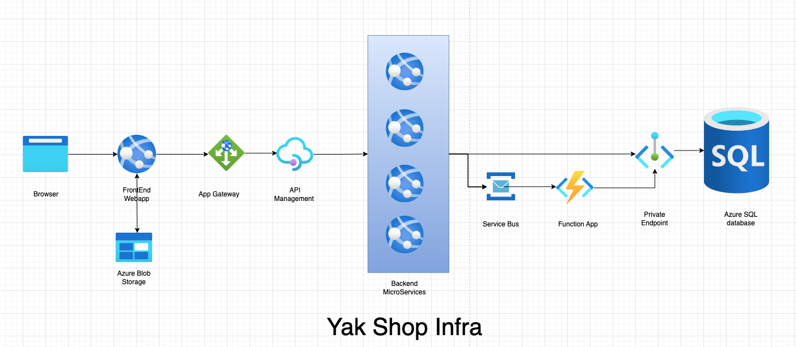

## System Design Document: Yakshop Infrastructure

**1. Introduction**

This document outlines the system design for the Yakshop infrastructure deployed on Azure. It describes the architecture, components, and key design decisions made during the implementation.

**Architecture Diagram**

**2. Goals**

*   Deploy a scalable, cost effective and resilient infrastructure for the Yakshop application.
*   Support multiple environments (Dev, Test, Acc, Prod) with environment-specific configurations.
*   Secure the infrastructure using network segmentation, managed identities, and key vault.
*   Automate the deployment process using Azure DevOps.
*   Monitor the health and performance of the application and infrastructure using Azure Monitor.

**3. Architecture Overview**

The Yakshop infrastructure follows a microservices architecture deployed on Azure. The key components include:

*   **Virtual Network (VNet):** Provides a private network for the application and its components.
*   **Subnets:**
    *   *Gateway Subnet:* Hosts public-facing resources like Application Gateway and API Management.
    *   *App Subnet:* Hosts the application's compute resources (Web Apps, Function App).
    *   *Database Subnet:* Hosts the Azure SQL Database with network isolation.
*   **Application Gateway:** Provides a secure entry point for the application with Web Application Firewall (WAF) capabilities.
*   **API Management (APIM):** Manages and secures the application's APIs. Also allows developers to develop multiple version of APIs and also to share with B2B customers.
*   **App Service Plan:** Provides the underlying compute resources for the Web Apps and Function App. It is auto scale enabled, so that undelying apps can scale out and in.
*   **Web Apps:**
    *   *Frontend:* Hosts the Node.js-based frontend application.
    *   *Backend:* Hosts the C# .NET Core microservices (user, product, order, payment).
*   **Function App:** Provides serverless compute for background tasks. But can also be used for any backend actions.
*   **Azure SQL Database:** Stores the application's relational data. Since the data is relational, I have selected the SQL database instead of NoSQL database like CosmosDB.
*   **Azure Storage Account:** Blob container stores unstructured data such as website assets. But it can be used also for database export or any other needs of application.
*   **Azure Service Bus:** Provides asynchronous messaging between microservices. I selected Azure service Bus because of more reliability, guaranteed delivery, integration with app services, Dead letter queues to re-process failed messages.
*   **Azure Key Vault:** Securely stores secrets, keys, and certificates.
*   **Azure Application Insights:** Collects and analyzes application telemetry.
*   **Managed Identities:** Provides secure identities for Azure resources to access other resources without storing credentials in code.
*   **Azure Monitor:** Provides monitoring and alerting capabilities for the infrastructure.

**4. Compute Platform Decision**

**Why Azure Web Apps (App Service) instead of Other Compute Options?**

Azure Web Apps (App Service) was selected as the primary compute platform for Yakshop due to the following reasons:

- **Managed Platform:** App Service is a fully managed platform-as-a-service (PaaS), reducing operational overhead for patching, scaling, and maintenance compared to IaaS (VMs) or container orchestration (AKS).
- **Built-in Scaling:** Supports automatic scaling (scale out/in) based on demand, without manual intervention.
- **Multi-runtime Support:** Supports Node.js, .NET, Java, Python, and custom containers, making it ideal for polyglot microservices.
- **Cost Efficiency:** Pay-as-you-go pricing and scaling options help optimize costs for different environments and workloads.
- **High Availability:** Built-in load balancing and support for deployment across multiple regions and availability zones.

**Alternatives Considered:**

- **Azure Kubernetes Service (AKS):** Offers more control and flexibility but adds significant operational complexity and is better suited for large-scale containerized workloads. Since Yak shepherd wants "bang for the buck", AKS is not ideal. He doesn't need team to maintain orchestration of containers.
- **Azure Virtual Machines:** Requires manual management of OS, scaling, patching, and networking, increasing operational burden.
- **Azure Functions:** Ideal for event-driven, serverless workloads but not suitable for always-on, stateful, or complex web applications.
- **Azure Container Apps:** Good for microservices, but App Service provides a simpler, more mature platform for web workloads.

**Conclusion:**  
Azure Web Apps provide the right balance of simplicity, scalability, security, and operational efficiency for Yakshop’s web and API workloads, making it the best fit for this architecture.

**5. Security Considerations**

*   **Network Segmentation:** The VNet and subnets provide network isolation between the application components.
*   **Web Application Firewall (WAF):** The Application Gateway provides WAF capabilities to protect the application from common web attacks.
*   **Managed Identities:** Managed identities are used to grant Azure resources access to other resources without storing credentials in code.
*   **Key Vault:** Secrets, keys, and certificates are securely stored in Azure Key Vault.
*   **Private Endpoints:** Azure SQL Database is accessed via a private endpoint, ensuring that traffic remains within the VNet.

**6. Scalability and Resiliency**

*   **App Service Plan:** The Elastic Premium App Service Plan provides automatic scaling capabilities for the Web Apps and Function App.
*   **Azure SQL Database:** The Azure SQL Database can be scaled up or down as needed.
*   **Azure Storage Account:** The Azure Storage Account is designed for high availability and durability.
*   **Azure Service Bus:** The Azure Service Bus provides reliable messaging between microservices.
*   **Availability Zones:** Consider deploying resources across availability zones for increased resiliency.

**7. Monitoring and Alerting**

*   Azure Application Insights is used to collect and analyze application telemetry.
*   Azure Monitor is used to create alerts for key metrics (CPU usage, HTTP errors).
*   Action groups are used to send email notifications when alerts are triggered.
